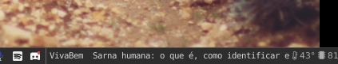

# menubar-feeds

<figure>

<figcaption>Working example using tint2 on Arch Linux.</figcaption>
</figure>

A code to subscribe to rss feeds and display the latest news on stdout. Useful for putting on your menubar.
